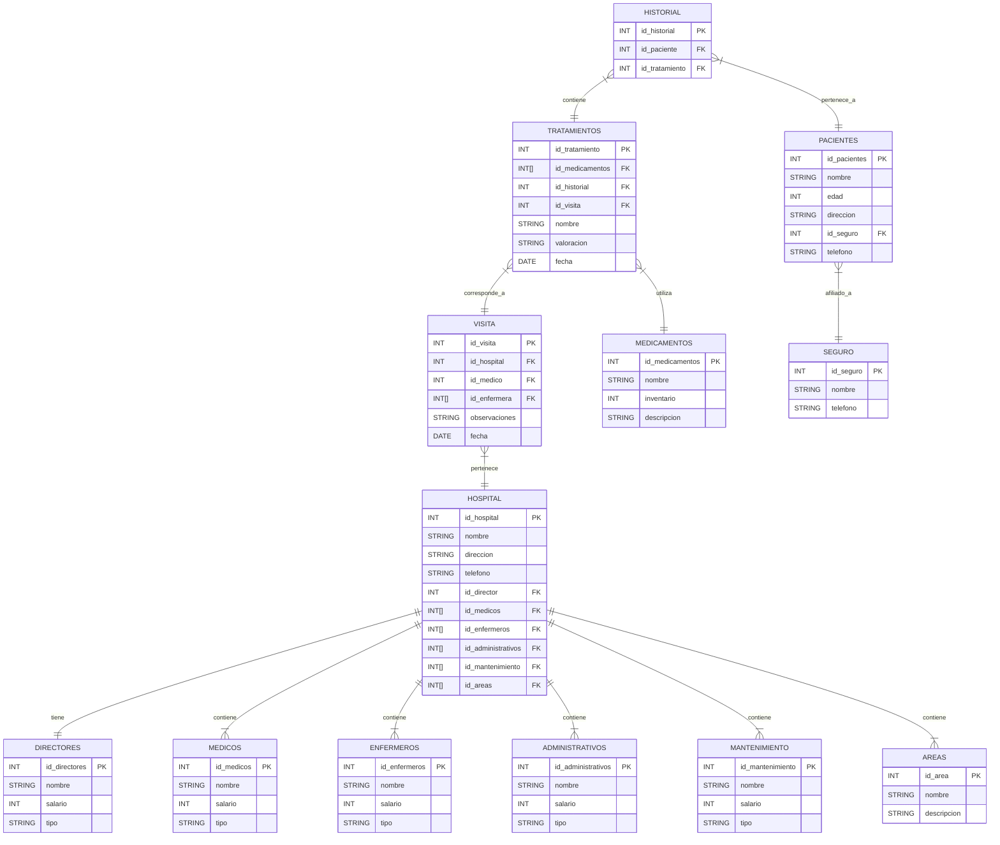

                                                         Proyecto MongoDB

                                                        

                                                 Gerson Steven Chaparro Martinez
                                                 
                                                  Harley Yefrey Cabrales Vargas
                                                  
                                                  
                                                               S1  
                                                               
                                                               
                                                   Pedro Felipe Gómez Bonilla
                                                   
                                                   
                                               Campuslands Artemis - Ruta Node
                                               
                                                    Bucaramanga, Santander 
                         
                                       

##                                                                                                Introducción

Este documento servirá como una guía detallada del proceso completo de diseño, estructuración e implementación de una base de datos para un sistema de salud. El objetivo principal es gestionar eficazmente los datos e información generados por los hospitales ,pacientes, médicos, tratamientos, medicamentos, historiales clínicos  y personal administrativo  administrados por el sistema hospitalario  pertinentes.  
Inicialmente, se analizará el caso de estudio junto con sus requerimientos específicos. A partir de esta investigación, se procederá a desarrollar un modelo conceptual detallado donde se identificarán las entidades principales, sus atributos y las relaciones entre ellas. Este paso determina las bases para comprender la estructura esencial de la gestión del sistema hospitalario  
A continuación, se realizará la conversión del modelo conceptual al modelo lógico. Este último ofrece una representación más precisa de cómo se organizará la información, facilitando una comprensión clara de la base de datos en desarrollo. .  
Posteriormente, se llevará a cabo la conversión del modelo lógico al modelo físico, el cual define la implementación real de entidades, atributos y relaciones, incorporando detalles técnicos como los tipos de datos adecuados para cada elemento.

Finalmente, se detallarán algunos procedimientos, funciones, consultas, triggers y eventos que complementarán la funcionalidad del sistema de información desarrollado, asegurando así su eficiencia y utilidad para el Sistema Hospitalario.  
Con estos pasos y elementos, se garantiza una guía completa y efectiva para el diseño y desarrollo de la base de datos necesaria para la gestión eficiente del Sistema Hospitalario.  

## Caso de Estudio

El Sistema Hospitalario nos ha pedido crear un diseño inicial de un Software que permita gestionar los datos e información acerca  pacientes, médicos, tratamientos, medicamentos, visitas médicas, historiales clínicos, áreas especializadas y personal administrativo, por lo que comenzamos estructurando los requerimientos dados:

### 1. Estructura del Sistema

- Un hospital puede tener múltiples áreas especializadas (Cardiología, Neurología, etc.).  
- Cada hospital tiene un director general, pero un director puede supervisar varios hospitales.  
- Cada hospital tiene un conjunto de médicos, enfermeras y personal administrativo.  
- Los hospitales deben contar con un historial detallado de pacientes y tratamientos realizados.  

### 2. Pacientes

- Los pacientes se identifican por su número de historia clínica, nombre, dirección, teléfono, correo electrónico y seguros médicos.  
- Los historiales médicos incluyen diagnósticos, tratamientos realizados y resultados obtenidos.  

### 3. Médicos y Personal

- Los médicos se identifican por su número de colegiatura, nombre, especialidad, teléfono, correo electrónico y salario.  
- Se definen los siguientes tipos de personal:  
  - **001: Director General:** Gestión general del hospital.  
  - **002: Médico Especialista:** Atiende pacientes y realiza diagnósticos.  
  - **003: Enfermero/a:** Asiste a médicos y cuida a los pacientes.  
  - **004: Personal Administrativo:** Gestión de recursos y logística.  
  - **005: Personal de Mantenimiento:** Mantenimiento y limpieza de las instalaciones.  

### 4. Tratamientos y Medicamentos

- Los tratamientos se identifican por su nombre, descripción, área médica relacionada y costo.  
- Los medicamentos se almacenan por nombre, fabricante, tipo, y disponibilidad en inventario.  

### 5. Visitas Médicas

- Las visitas médicas se registran con fecha, hora, médico asignado, paciente atendido y diagnóstico.  
- Los pacientes pueden tener múltiples visitas médicas a lo largo del tiempo.  

Con base en la información anterior, se procederá a crear una base de datos en MongoDB con el objetivo de agrupar y relacionar los datos de los hospitales , así como la información y gestión de cada uno de sus requerimientos.  

## Instalación General

Los archivos relacionados con la BBDD de los hospitales, se encuentran en la plataforma <Githud>  estos archivos se encuentran en formato NoSQL y se dividen en 6 partes:

❖ ModeloFisico.NoSQL : Este archivo contiene el script para crear la base de datos y definir las tablas correspondientes.  
❖ Inserciones.NoSQL : Este archivo contiene ejemplos de datos para gestionar los parques naturales, facilitando la inserción inicial de información.  
❖ Consultas.NoSQL : En este archivo se encuentran las consultas relacionadas con los departamentos, parques e investigaciones realizadas en los parques naturales.  
❖ funcionesYprocedimientos.NoSQL : Se definen los procedimientos y funciones para añadir, actualizar y mostrar datos dentro del sistema.  
❖ Triggers_Eventos_Transacciones.NoSQL : Contiene los triggers, eventos y transacciones configurados para registrar la entrada de cada visitante mediante la inserción y actualización de datos específicos.  
❖ usuarios.NoSQL : Aquí se gestionan la creación de usuarios y la asignación de permisos necesarios para acceder y visualizar los datos pertinentes.  

## Planificación

## Ejecución

Una vez se analizó la información requerida por el Sistema Hospitalario, se inició la creación del modelo conceptual. Este modelo proporciona una descripción de alto nivel de las necesidades de información que están detrás del diseño de una base de datos. Representa los conceptos principales de la base de datos y las relaciones entre ellos.

### Construcción del Modelo Conceptual

Se diseñó el modelo conceptual identificando cada una de las entidades, sus atributos y las relaciones entre ellas. Este modelo conceptual proporciona una visión clara y estructurada de cómo se organizarán y conectarán los diferentes elementos de la base de datos.  
Para entender el diseño del modelo conceptual, se debe tener en cuenta los elementos básicos de un modelo original.  

## Descripción

### Las Entidades y Atributos

1. directores  
❖ id_directores  
❖ nombres  
❖ salario  
❖ tipo  

2. medicina  
❖ id_medicos  
❖ nombre  
❖ salario  
❖ tipo  

3. enfermeros  
❖ id_enfermeros  
❖ nombre  
❖ salario  
❖ tipo  

4. adminitrativos  
❖ id_administrativos  
❖ nombre  
❖ salario  
❖ tipo  

5. Mantenimiento  
❖ id_mantenimiento  
❖ nombre  
❖ salario  
❖ tipo  

6. Areas  
❖ id_areas  
❖ nombre  
❖ descripción  

7. hospital  
❖ id_hospital  
❖ nombre  
❖ direccion  
❖ telefono  
❖ id_director  
❖ id_medicos  
❖ id_enfermeros  
❖ id_administrativos  
❖ id_mantenimiento  
❖ id_areas  

8. visita  
❖ id_visita  
❖ id_hospital  
❖ id_medico  
❖ id_enfermeros  
❖ observaciones  
❖ fecha  

9. tratamiento  
❖ id_tratamiento  
❖ id_medicamentos  
❖ id_historial  
❖ id_visita
❖ nombre
❖ valoracion
❖ fecha  

11. medicamento  
❖ id_medicamentos  
❖ nombre  
❖ inventario  
❖ descripcion  

12. historial  
❖ id_historial  
❖ id_paciente  
❖ id_tratamiento  

13. paciente  
❖ id_paciente  
❖ nombre  
❖ edad  
❖ direccion  
❖ id_seguro  
❖ telefono  

14. seguro  
❖ id_seguro  
❖ nombre  
❖ telefono  

## Relaciones y Cardinalidades

Se realizó las relaciones y cardinalidades respectivas del modelo conceptual con sus entidades para tener mejor visualización de la base de datos:

- Hospital – Área: 1 hospital → muchas áreas.  
- Hospital – Personal: 1 hospital → muchos empleados.  
- Hospital – Director: 1 hospital → 1 director (que es parte del personal).  
- Paciente – Historial Clínico: 1 paciente → 1 historial (que puede tener muchos diagnósticos y tratamientos).  
- Visita Médica – Paciente: muchos a 1 (varias visitas para un mismo paciente y un mismo médico puede atender muchas visitas).  

## Modelo conceptual

## Modelo Logico

## Modelo Fisico

